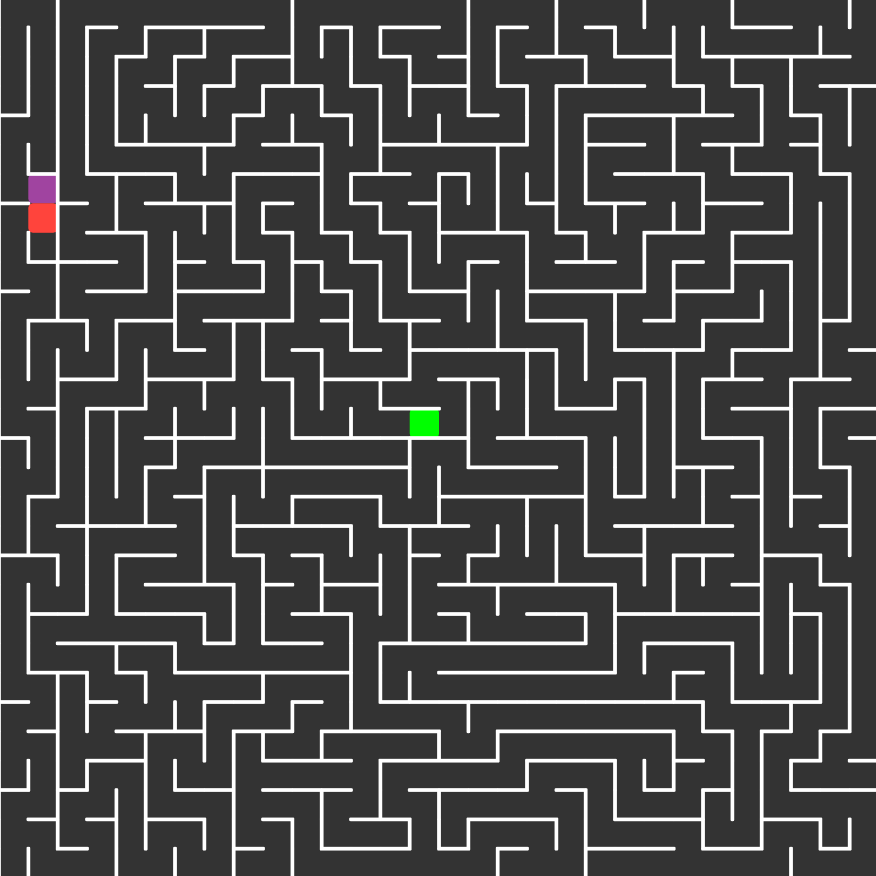

# Maze solver using DFS

## Input
The input must be a maze created by the [Maze Generator](../mazeGenerator) algorithm
- The inputs mazes are located in `inputs.js` file

## Parameters
You can customize the algorithm parameters bu setting the following variables accordingly:
- `canvasDimensions`: the width/height of the maze
- `start`: start point coordinates
- `end`: end point coordinates
- `input`: the maze (from `inputs.js`) that will be used
